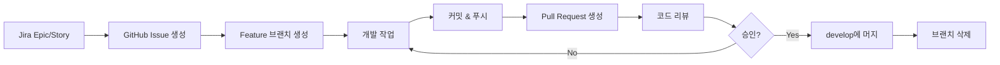

# Build-Up Backend 개발 환경 세팅 가이드

> 이 문서는 Build-Up Platform 백엔드 개발자를 위한 초기 환경 세팅 가이드입니다.
> 작성일: 2025-11-01
> 대상: 2명의 백엔드 개발자

---

## 📚 목차

1. [프로젝트 개요](#프로젝트-개요)
2. [사전 준비사항](#사전-준비사항)
3. [개발 환경 세팅](#개발-환경-세팅)
4. [워크플로우](#워크플로우)
5. [자주 묻는 질문](#자주-묻는-질문)
6. [트러블슈팅](#트러블슈팅)

---

## 🎯 프로젝트 개요

### 기술 스택

| 분류 | 기술 | 버전 |
|------|------|------|
| Language | Java | 21 (LTS) |
| Framework | Spring Boot | 3.5.7 |
| ORM | Spring Data JPA | - |
| Security | Spring Security | 6.x+ |
| Database | MySQL | 8.0 |
| Build Tool | Gradle | 8.x |
| Containerization | Docker & Docker Compose | - |

### 프로젝트 구조

```
BU-Server/
├── src/
│   ├── main/
│   │   ├── java/com/concrete/buildup/
│   │   │   ├── domain/              # 도메인별 기능 (개발 예정)
│   │   │   ├── global/              # 전역 설정 (완료)
│   │   │   │   ├── config/          # Security, JPA, Web
│   │   │   │   ├── exception/       # 전역 예외 처리
│   │   │   │   └── common/          # 공통 응답 포맷
│   │   │   └── BuildupApplication.java
│   │   └── resources/
│   │       ├── application.yml      # 공통 설정
│   │       ├── application-dev.yml  # 개발 환경
│   │       └── application-prod.yml # 운영 환경
│   └── test/                        # 테스트 코드
├── docker/
│   └── mysql/init/                  # DB 초기화 스크립트
├── .github/                         # GitHub 템플릿
│   ├── ISSUE_TEMPLATE/
│   └── pull_request_template.md
├── docker-compose.dev.yml           # 개발용 Docker
├── start-dev.sh                     # 개발 시작 스크립트
├── .env.example                     # 환경변수 템플릿
├── README.md                        # 프로젝트 소개
└── CONTRIBUTING.md                  # 협업 가이드
```

---

## 🛠 사전 준비사항

### 1. 필수 설치 항목

#### Java 21 설치

**macOS (Homebrew):**
```bash
# OpenJDK 21 설치
brew install openjdk@21

# 환경변수 설정
echo 'export PATH="/opt/homebrew/opt/openjdk@21/bin:$PATH"' >> ~/.zshrc
source ~/.zshrc

# 설치 확인
java -version
```

**Windows:**
- [Oracle JDK 21](https://www.oracle.com/java/technologies/downloads/#java21) 또는 [Adoptium OpenJDK 21](https://adoptium.net/) 다운로드 및 설치

#### IntelliJ IDEA 설치

- [IntelliJ IDEA Ultimate](https://www.jetbrains.com/idea/download/) 권장 (학생 라이센스 활용)
- Community Edition도 가능하나 일부 기능 제한

**IntelliJ 플러그인 설치:**
- Lombok
- Spring Boot
- JPA Buddy (선택사항)

#### Docker Desktop 설치

- [Docker Desktop](https://www.docker.com/products/docker-desktop/) 다운로드 및 설치
- 설치 후 Docker Desktop 실행 확인

#### Git 설치

```bash
# macOS
brew install git

# Windows - Git Bash 포함
# https://git-scm.com/download/win
```

### 2. 계정 준비

- [ ] GitHub 계정 (조직 레포지토리 접근 권한 필요)
- [ ] Jira 계정 (프로젝트 접근 권한)
- [ ] Notion 계정 (팀 워크스페이스 접근)
- [ ] Slack 계정 (팀 채널 참여)

---

## 🚀 개발 환경 세팅

### Step 1: 프로젝트 클론

```bash
# 프로젝트 클론
git clone <repository-url>
cd BU-Server

# develop 브랜치로 전환 (메인 개발 브랜치)
git checkout develop

# 최신 코드 받기
git pull origin develop
```

### Step 2: IntelliJ 프로젝트 열기

1. IntelliJ IDEA 실행
2. **Open** → 클론한 `BU-Server` 디렉토리 선택
3. Gradle 자동 임포트 대기 (2-3분 소요)
4. **Project Structure** 확인:
   - File → Project Structure
   - Project SDK: Java 21 설정
   - Language level: 21

### Step 3: Lombok 설정 (IntelliJ)

1. **Settings** → **Plugins** → "Lombok" 검색 및 설치
2. **Settings** → **Build, Execution, Deployment** → **Compiler** → **Annotation Processors**
3. **Enable annotation processing** 체크

### Step 4: 환경변수 설정

```bash
# .env.example을 복사하여 .env 생성
cp .env.example .env

# .env 파일 내용 (기본값 사용 가능)
SPRING_PROFILES_ACTIVE=dev
MYSQL_DATABASE=buildup
MYSQL_USER=buildup
MYSQL_PASSWORD=buildup123
```

### Step 5: 개발 환경 실행

#### 방법 1: start-dev.sh 사용 (권장)

```bash
# 실행 권한 부여 (최초 1회)
chmod +x ./start-dev.sh

# 개발 환경 시작
./start-dev.sh
```

**이 스크립트가 자동으로 수행하는 작업:**
- ✅ Docker Compose로 MySQL + phpMyAdmin 시작
- ✅ MySQL 연결 대기 및 확인
- ✅ Spring Boot 애플리케이션 실행 (dev 프로파일)

**서비스 접속 정보:**
- 애플리케이션: http://localhost:8080/api
- Swagger UI: http://localhost:8080/api/swagger-ui/index.html
- phpMyAdmin: http://localhost:8081
  - Username: `root`
  - Password: `root`

#### 방법 2: IntelliJ에서 직접 실행

1. MySQL 컨테이너만 먼저 시작:
   ```bash
   docker-compose -f docker-compose.dev.yml up -d mysql
   ```

2. IntelliJ에서 `BuildupApplication` 실행:
   - Run → Edit Configurations
   - Active profiles: `dev` 입력
   - Run

### Step 6: 정상 동작 확인

**1. 헬스체크:**
```bash
curl http://localhost:8080/api/actuator/health
```

**응답 예시:**
```json
{
  "status": "UP"
}
```

**2. Swagger UI 접속:**
- http://localhost:8080/api/swagger-ui/index.html
- API 문서 및 테스트 가능

**3. phpMyAdmin 접속:**
- http://localhost:8081
- `buildup` 데이터베이스 확인

---

## 🔄 워크플로우

### Jira → GitHub → 개발 → PR 프로세스



### 1. Jira에서 작업 시작

1. Jira Epic 또는 Story 확인
2. Story를 Task로 분할 (1-2일 단위)
3. Task를 본인에게 할당

### 2. GitHub Issue 생성

**이슈 제목 형식:**
```
[JIRA-123] 사용자 인증 기능 구현
```

**이슈 템플릿 사용:**
- Feature Request: 새 기능
- Bug Report: 버그 수정

### 3. 브랜치 생성 및 개발

```bash
# develop에서 최신 코드 받기
git checkout develop
git pull origin develop

# 기능 브랜치 생성
git checkout -b feature/JIRA-123-user-auth

# 개발 작업...

# 커밋 (커밋 메시지 규칙 준수)
git add .
git commit -m "feat: [JIRA-123] 사용자 인증 API 구현"

# 원격에 푸시
git push origin feature/JIRA-123-user-auth
```

### 4. Pull Request 생성

1. GitHub에서 PR 생성
2. PR 템플릿 내용 작성
3. Reviewer 지정 (팀원)
4. Label 추가 (feature, bug, etc.)

### 5. 코드 리뷰

**리뷰어:**
- 24시간 이내 리뷰
- 코드 품질, 로직, 보안, 성능 검토
- 건설적인 피드백 제공

**작성자:**
- 피드백 반영
- 수정 후 재요청

### 6. 머지 및 정리

```bash
# PR 승인 후 GitHub에서 머지 (Squash and Merge 권장)

# 로컬 브랜치 정리
git checkout develop
git pull origin develop
git branch -d feature/JIRA-123-user-auth
```

---

## ❓ 자주 묻는 질문

### Q1. Lombok 어노테이션이 인식되지 않아요

**A:** IntelliJ에서 Lombok 플러그인 설치 및 Annotation Processing 활성화 확인
```
Settings → Build, Execution, Deployment → Compiler → Annotation Processors
→ Enable annotation processing 체크
```

### Q2. MySQL 연결 오류가 발생해요

**A:** Docker 컨테이너 상태 확인
```bash
# 컨테이너 상태 확인
docker ps

# MySQL 로그 확인
docker-compose -f docker-compose.dev.yml logs mysql

# 컨테이너 재시작
docker-compose -f docker-compose.dev.yml restart mysql
```

### Q3. 포트 충돌 오류가 발생해요

**A:** 이미 사용 중인 포트 확인 및 종료
```bash
# macOS/Linux
lsof -i :8080
lsof -i :3306

# 프로세스 종료
kill -9 <PID>

# Windows
netstat -ano | findstr :8080
taskkill /PID <PID> /F
```

### Q4. Swagger UI에 API가 안 보여요

**A:**
- `application-dev.yml`에서 Swagger 활성화 확인
- Controller에 `@RestController` 어노테이션 확인
- Base path: `/api` 확인

### Q5. JPA Entity가 테이블로 생성되지 않아요

**A:**
- `application-dev.yml`에서 `ddl-auto: update` 확인
- Entity 클래스에 `@Entity` 어노테이션 확인
- Entity가 `com.concrete.buildup` 패키지 하위에 있는지 확인

---

## 🔧 트러블슈팅

### Docker 관련

#### 문제: Docker Desktop이 실행되지 않음
```bash
# macOS
open -a Docker

# Docker 데몬 상태 확인
docker info
```

#### 문제: 컨테이너가 시작되지 않음
```bash
# 전체 정리 후 재시작
docker-compose -f docker-compose.dev.yml down -v
docker-compose -f docker-compose.dev.yml up -d

# 볼륨 확인
docker volume ls
```

### Spring Boot 관련

#### 문제: 애플리케이션이 시작되지 않음
```bash
# 빌드 정리
./gradlew clean

# 의존성 재다운로드
./gradlew build --refresh-dependencies

# 로그 확인
# IntelliJ Run 창에서 에러 메시지 확인
```

#### 문제: 테스트 실패
```bash
# 테스트만 실행
./gradlew test

# 특정 테스트 실행
./gradlew test --tests BuildupApplicationTests

# 테스트 스킵하고 빌드
./gradlew build -x test
```

### Git 관련

#### 문제: develop 브랜치와 충돌
```bash
# develop 최신화
git checkout develop
git pull origin develop

# 작업 브랜치로 돌아가서 rebase
git checkout feature/JIRA-123-user-auth
git rebase develop

# 충돌 해결 후
git add .
git rebase --continue
git push -f origin feature/JIRA-123-user-auth
```

---

## 📞 지원 및 문의

### 문서 링크
- **Jira**: [프로젝트 Jira 보드]
- **GitHub**: [레포지토리 링크]
- **Notion**: [팀 워크스페이스]
- **API 문서**: http://localhost:8080/api/swagger-ui/index.html

### 커뮤니케이션
- **Slack**: #buildup-backend 채널
- **일일 스탠드업**: 매일 오전 10시
- **코드 리뷰**: PR 생성 후 24시간 이내

### 긴급 상황
- 빌드/배포 이슈: Slack DM
- 보안 이슈: 즉시 팀 리드에게 보고

---

## ✅ 최종 체크리스트

개발 환경이 제대로 세팅되었는지 확인하세요:

- [ ] Java 21 설치 및 버전 확인
- [ ] IntelliJ IDEA 설치 및 프로젝트 로드
- [ ] Lombok 플러그인 설치 및 활성화
- [ ] Docker Desktop 설치 및 실행
- [ ] 프로젝트 클론 및 develop 브랜치 전환
- [ ] .env 파일 생성
- [ ] start-dev.sh 실행 성공
- [ ] http://localhost:8080/api/actuator/health 접속 확인
- [ ] Swagger UI 접속 확인
- [ ] phpMyAdmin에서 buildup 데이터베이스 확인
- [ ] CONTRIBUTING.md 문서 읽기
- [ ] GitHub 계정 레포지토리 접근 권한 확인
- [ ] Jira 계정 프로젝트 접근 권한 확인
- [ ] Slack 채널 참여 확인

**모든 항목이 체크되었다면 개발 준비 완료입니다!** 🎉

---

**문서 작성일:** 2025-11-01
**문서 버전:** 1.0
**작성자:** Build-Up Team
